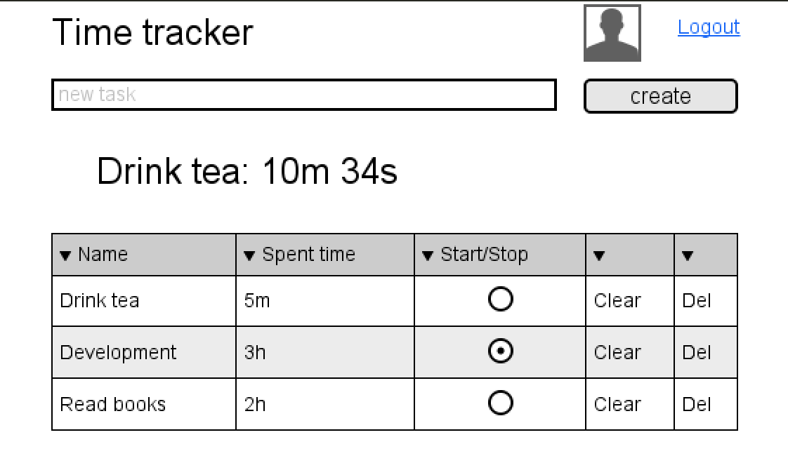

1. Пройти тьюториал - https://facebook.github.io/react/docs/tutorial.html
2. Реализовать интерфейс таймера на react-bootstrap (https://react-bootstrap.github.io/). 

Дополнительный материал
1. Мой пост про изоморфные приложения - http://blog.koorchik.com/isomorphic-react/ и видео с конфы https://www.youtube.com/watch?v=YQDfCnoAnEk
2. Неплохой пост "9 things every React.js beginner should know" - https://camjackson.net/post/9-things-every-reactjs-beginner-should-know

